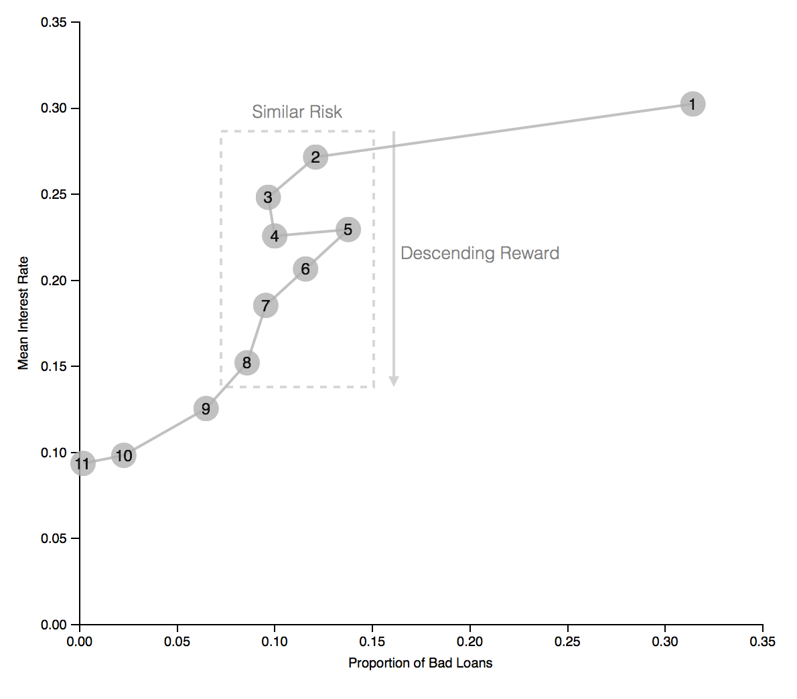

# udacity-dataviz-proj

Data Visualization project for Udacity Data Analyst course.

If you want to jump straight to the results, please [click here](http://bl.ocks.org/vbernardes/9493fd7ae396cd9e59223029771aa216) for the final plot. Previous iterations can be found [here](http://bl.ocks.org/vbernardes/c7fa975fd61400bbbc8cadbd01e1f340) and [here](http://bl.ocks.org/vbernardes/896d0879221501c9123dde33f30da12e).

## Summary

Prosper is a peer-to-peer lending platform that allows investors to choose among personal loans requested by borrowers to invest in, considering credit scores, ratings, among other factors, which include a custom calculated *Prosper Score* that represents the risk for each loan. The higher the risk, the higher the interest rates paid by the borrower to the investors.

However, this visualization shows that, on average, loans with a *Prosper Score* of 2-4 (higher risk) had similar proportions of bad loans (defaulted loans, charged off loans or loans past due) as loans with a score of 6-8 (lower risk), even though their interest rate was significantly higher. In other words, investors who invested in loans with a score of 6-8 expected lower risk loans — and received lower rates in return — but ended up with risky loans just the same.

## Design

The following lists the initial design choices.

### Initial versions

#### Chart type

Since the visualization shows continuous data (mean interest rate and proportion of good/bad loans) for values of a categorical variable, I opted to use a bar chart.

#### Visual encodings

This visualization displays two basic bar charts. Since it is a chart type most readers are familiar with, for better readability, I chose to keep visual encodings to a minimum and rely more on the length of the bars to allow readers to view the variable values and to perform comparisons.

Bars were colored in light grey, allowing the use of color when needed to highlight certain aspects of the charts (see below).

Initially I had a few ideas on how to draw the reader’s attention to the bars I wanted to highlight. Those bars were crucial to helping them understand the message I was trying to convey with the visualization. These ideas included horizontal reference lines, coloring the bars, and adding annotations.  

For the first version of the visualization, I opted to use both annotations and to simultaneously color bars on both charts on mouse-over, to help the reader compare the interest rate and proportion of bad loans for a given Prosper Score.

Upon receiving feedback, I implemented the colors a little differently. Two bars (3 and 7) were colored in both charts from the start in order to highlight the discrepancies between risk and return I wanted to show with the visualization. Also, I kept annotations that helped convey that message.

#### Layout

Since both charts share the same variable (*Prosper Score*) on the x axis, I opted to display them on top of each other. That makes sure the bars for each Prosper Score are aligned directly on top of each other, allowing the reader to more easily understand the data being shown for each individual score and how it relates to the other adjacent scores.

Also, for clarity, I opted to remove gridlines.

### Final version

#### Chart type

After receiving feedback, I decided to condense both charts into one, so the reader would not have to jump between charts. I created a connected scatter plot for the final version.

#### Visual encodings

In order to keep the visualization as simple as possible — for better readability — I chose not to use colors for this version. 

Each Prosper Score was displayed as a fixed-size bubble (size is not being used as an encoding here), with lines connecting adjacent scores, so the reader can follow the changes between *interest rates* and *proportion of bad loans* for each score.

Annotations were essential in this chart in helping convey the intended message, by drawing the reader’s attention to the relevant areas and showing key takeaways.

## Feedback

#### Feedback #1:

The charts were considered to convey their message well. However, the visualization summary was deemed confusing, and could use a rewrite for clarity.

#### Feedback #2:

The mouse-over coloring feature was not considered to add much value to the visualization, so it was suggested that the chart instead contain fixed colors on some bars in order to highlight the intended message.

#### Feedback #3:

It was suggested that I try to condense both charts into one, so as not to have the reader jump between charts. A connected scatter plot looks like a good candidate for this.

The original feedback comment can be found [here](https://www.reddit.com/r/visualization/comments/9jen9a/seeking_feedback_on_my_first_basic_visualization/).

## Resources

In order to keep this file concise, please refer to the `References.txt` file for any external resources.